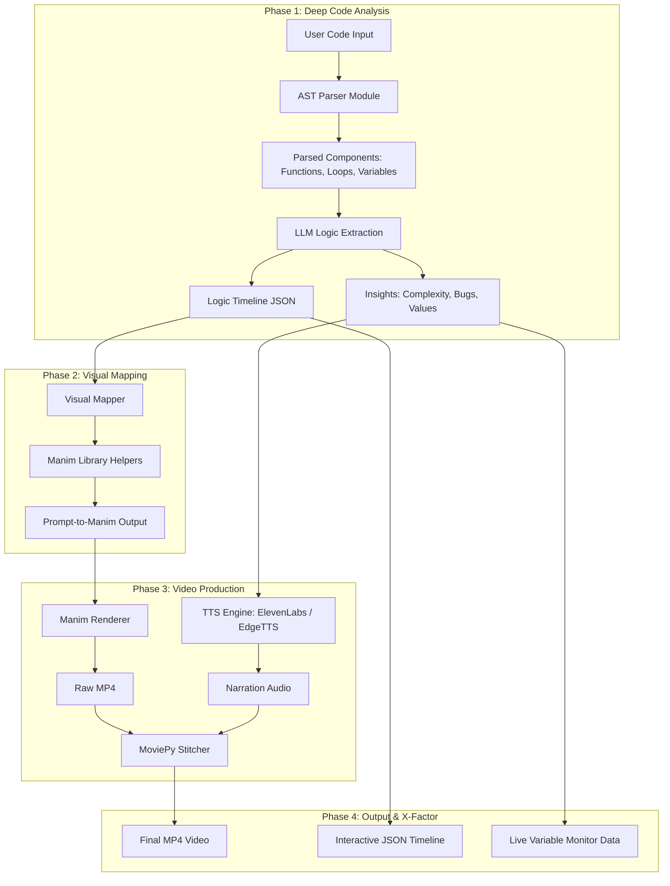

# Dev-to-Doc Animator Platform - Backend Implementation

This plan covers the visual architecture of the entire pipeline and the specific implementation details for **Phase 1: Deep Code Analysis**.

## Architecture Overview

Here is a visual representation of your proposed workflow. You can view this diagram directly here, or **import it into Draw.io** by copying the code below and going to `Arrange` -> `Insert` -> `Advanced` -> `Mermaid` in the Draw.io editor.

## Proposed Changes: Phase 1 (Deep Code Analysis)

To start with Phase 1, we will implement the following core components in the backend:

### Phase 1: Code Parsing and Extraction
#### [NEW] `analyzer/parser.py`
A module using Python's built-in `ast` module to break down provided user code into distinct structural components. It will extract functional blocks, loops, definitions, and essential variables to prevent the LLM from hallucinating logic.

#### [NEW] `analyzer/llm_extractor.py`
A module responsible for taking the parsed AST components and communicating with an LLM. It will prompt the LLM to generate two distinct objects:
1. **Logic Timeline**: A heavily structured step-by-step breakdown (JSON format).
2. **Insights**: Time complexity, space complexity, dry-run values, and narration script.

#### [MODIFY] `main.py`
We will set up the entry point in `main.py` to ingest a sample python script, run it through the AST parser, pass the components to the `llm_extractor`, and print out the resulting Timeline and Insights for verification.

## Open Questions

> [!IMPORTANT]
> **LLM Choice for Phase 1**
> You mentioned GPT-4o or Claude 3.5 Sonnet in the prompt. Do you have API keys ready for these, or would you prefer we use the Google Gemini API (which is also highly capable of this) since this environment might already be geared towards it?

> [!TIP]
> **Draw.io Import**
> To view the diagram in Draw.io, simply copy the `mermaid` code block above, open app.diagrams.net, and click `Arrange > Insert > Advanced > Mermaid...` and paste it there!

## Verification Plan

### Automated/Manual Verification
1. We will create a small sample code snippet (e.g., a Bubble Sort implementation).
2. Run `python main.py` with the sample code.
3. Verify that the AST parser correctly identifies the loops/swaps.
4. Verify that the LLM reliably outputs a clean JSON timeline and insights without hallucinations.
